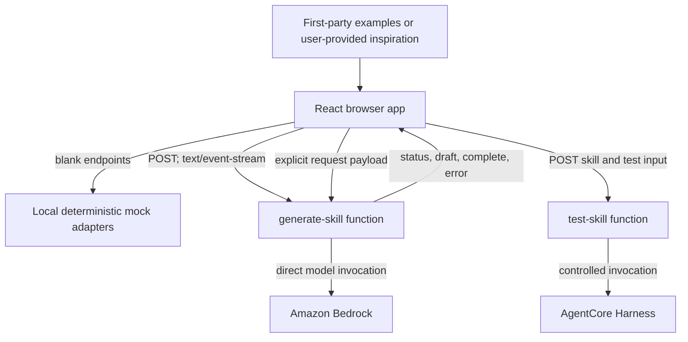

# Architecture context — Kiro Collab Skill Kit

## System boundary

Kiro Collab Skill Kit is a standalone application rooted at `kiro-collab-skill-kit/`. It contains a Vite React skill-builder and project-local direct-generation and test-function foundations. The specifications in `.kiro/specs/` govern the remaining completion and hardening work, which is limited to direct Amazon Bedrock generation and AgentCore Harness testing.

No Registry, marketplace, publication service, remote inspiration fetcher, shared workspace, or human-human real-time service belongs in this architecture.

## Module boundaries

| Area | Path | Responsibility |
| --- | --- | --- |
| Browser app | `src/` | Editor, local inspiration selection, mode indicators, SSE client, mock adapters, test-result display, download. |
| Shared contracts | `shared/` | Validated request, SSE event, draft, and test-result types usable by browser and functions. |
| Direct generation | `amplify/functions/generate-skill/` | Validate input, build an auditable direct Bedrock request, stream bounded events, redact operational errors. |
| Skill testing | `amplify/functions/test-skill/` | Validate test input, invoke the configured AgentCore Harness, normalize/redact output, enforce timeout. |
| Project context | `.kiro/` | Product constraints, design decisions, generation contract, authoring skill, and implementation specs. |

Planned paths are not an instruction to create unrelated services. Do not cross the nested-project boundary or import parent-project modules.

## Request flow

1. The browser collects a goal, optional local first-party or user-provided inspiration, and user edits.
2. With `VITE_GENERATE_API_URL` blank, a deterministic mock adapter produces labeled local events. With it set, the browser opens a fetch request expecting `text/event-stream`.
3. The generation function validates the request, applies the project generation contract, invokes Bedrock directly, and emits only the defined SSE event sequence.
4. The browser applies draft events in order, permits editing, and downloads a local `SKILL.md` only after explicit user action.
5. A test request similarly uses mock mode when `VITE_TEST_SKILL_API_URL` is blank; otherwise the test function validates it and invokes the configured Harness.

## SSE contract

Use named SSE events with JSON data, never unstructured server logs:

- `status` — `{ requestId, stage, message }`; stages are `accepted`, `validating`, `generating`, or `finalizing`.
- `draft` — `{ requestId, markdown }`; `markdown` is a complete replacement draft.
- `complete` — `{ requestId, markdown }`; terminal success.
- `error` — `{ requestId, code, message, retryable }`; terminal failure with no internal stack or cloud detail.

Every request has a browser-generated `requestId`. The client must ignore events for other requests, stop updates after a terminal event, and use `AbortController` when the user cancels or navigates away. The server sends a short heartbeat/status while a live request is active and stops work when the connection abort is detected.

## Data and provenance boundaries

The browser is the source of the session draft. Inspiration is either a bundled original first-party example or content the user deliberately provides. Preserve a source label (`first-party-example` or `user-provided`) in the request and generated-draft metadata. Do not fetch, index, store, or imply rights to third-party skills.

Do not persist prompts, inspiration, generated drafts, test payloads, or Harness output unless a separately approved feature adds explicit user controls, retention rules, and authorization design.

## Reliability and security principles

- Validate payload schema, size, and allowed origin before any direct Bedrock or Harness call.
- Keep cloud credentials, model configuration, Harness identifiers, and CORS policy in backend-only environment configuration.
- Apply output and event-size caps, timeouts, cancellation, and bounded retries.
- Redact internal error messages and sensitive Harness output before it reaches the browser.
- Make mock mode deterministic and visibly distinct from live mode.

## Extension boundary

Optional Registry integration and shared-workspace capabilities can be evaluated only as future, separately scoped architectures. They must not be added to current request schemas, UI flows, or deployment permissions.
