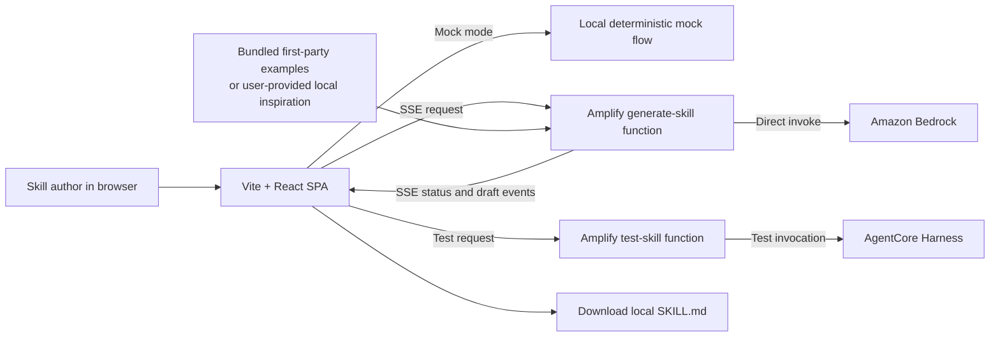

# Kiro Collab Skill Kit

Kiro Collab Skill Kit is a standalone React and AWS Amplify project for drafting, refining, testing, and downloading Kiro `SKILL.md` files with an AI assistant. It is intentionally extractable: it has no dependency on the surrounding repository or a hosted service.

> **Project status:** The repository includes a standalone browser skill-builder and direct generation/test backend foundations, with local mock configuration available by default. The `.kiro` specifications define the scoped completion, reliability, testing, and hardening work. Current type and test validation issues in restricted implementation files are recorded below as project blockers, not documentation workarounds.

## MVP scope

The MVP supports one person working with an AI assistant in a browser. Skill generation uses **direct Amazon Bedrock** calls; inspiration is supplied locally by the user or comes from bundled first-party examples; test execution uses an **AgentCore Harness**; and generation progress is delivered through **SSE**.

The MVP explicitly does **not** include a Registry, marketplace, publication workflow, resource discovery, shared workspace, presence indicators, chat between people, or any other human-human real-time collaboration feature. These are future extensions, not partial MVP dependencies.

## Architecture



The browser never receives AWS credentials, Bedrock credentials, Harness identifiers, or server-side access-control configuration. Planned backend paths are `amplify/functions/generate-skill/` and `amplify/functions/test-skill/`; the frontend integration belongs under `src/` and shared contracts under `shared/`.

## Prerequisites

- Node.js **22 or later**
- npm
- For local mock development: no AWS account or cloud credentials
- For live generation and testing: an AWS account, AWS CLI credentials for the intended account, and permissions to deploy Amplify resources
- Amazon Bedrock model access in the intended deployment Region and permission for the backend execution role to invoke the configured model
- An AgentCore Harness reachable by the backend execution role for live skill tests

Do not put AWS credentials, model credentials, or Harness identifiers in browser variables. Configure cloud access through Amplify backend configuration and deployment roles.

## Local mock setup

From this nested project root:

```bash
cd kiro-collab-skill-kit
npm install
cp .env.example .env.local
npm run dev
```

Leave both public API URL variables blank to keep mock behavior enabled:

```dotenv
VITE_GENERATE_API_URL=
VITE_TEST_SKILL_API_URL=
```

Vite serves the application at `http://localhost:5174` by default. Mock mode must remain visibly labeled in the UI when the skill-builder port is implemented; it must make no cloud calls.

## Environment variables

| Variable | Where it belongs | Purpose |
| --- | --- | --- |
| `VITE_GENERATE_API_URL` | `.env.local` for development or hosting environment configuration | Public HTTPS endpoint for the generation SSE route. Blank selects the local mock flow. |
| `VITE_TEST_SKILL_API_URL` | `.env.local` for development or hosting environment configuration | Public HTTPS endpoint for the test route. Blank selects the local mock result. |
| `HARNESS_ARN` | Amplify backend environment only | Identifier of the Harness used by the test function. Never expose it in browser code. |
| `HARNESS_REGION` | Amplify backend environment only | Region of the configured Harness. |
| `ALLOWED_ORIGIN` | Amplify backend environment only | Exact allowed browser origin for function responses. |

No live values are committed. See `.env.example` for the safe template.

## Development and verification

Run these commands from `kiro-collab-skill-kit/`:

```bash
npm run typecheck
npm test
npm run build
npm run verify:standalone
```

`npm run test:watch` runs Vitest interactively. `npm run test:live:generation` intentionally exits non-zero until the direct Bedrock backend is configured; it is a guardrail, not a substitute for mock tests. After backend code exists, use `npm run sandbox` in a separate terminal to deploy an isolated Amplify sandbox before exercising live endpoints.

## Challenge demo script

Use this short demonstration after the skill-builder and test specs are implemented:

1. Start in mock mode with the two `VITE_*_API_URL` values blank and run `npm run dev`.
2. Open `http://localhost:5174`; confirm the UI labels the session as mock mode.
3. Enter a focused request, such as: “Create a Kiro skill for reviewing a TypeScript pull request, using only files I provide as inspiration.”
4. Add one bundled first-party example or paste a user-provided excerpt. Confirm the source label appears and no remote discovery is offered.
5. Generate the draft and observe ordered SSE status events, then edit the rendered `SKILL.md` content.
6. Run the mock test, inspect the structured pass/fail result, and download `SKILL.md` locally.
7. For the live variant, configure backend-only Harness settings, deploy a sandbox, set both public endpoint URLs, and repeat steps 3–6. Verify the browser receives no cloud secrets and that Harness output is redacted before display.

## AWS deployment with Amplify Hosting

The included `amplify.yml` is a monorepo configuration whose application root is `kiro-collab-skill-kit`. Connect the parent repository in Amplify Hosting, select that configuration, and configure the Hosting application to build this nested root. Amplify executes `npm install` and `npm run build` inside `kiro-collab-skill-kit`, then serves its `dist/` output.

Before a live deployment:

1. Validate and deploy the project-local direct-generation and test backend functions from this nested project.
2. Grant the backend execution roles least-privilege permission for the configured Bedrock model and specific Harness.
3. Set `HARNESS_ARN`, `HARNESS_REGION`, and a production `ALLOWED_ORIGIN` as backend-only variables.
4. Set only the public endpoint URLs as frontend build-time environment variables.
5. Verify the deployed origin, CORS response, SSE disconnect behavior, and that no generated content or test output includes secrets.

## Security and cost notes

- Treat user prompts, uploads, and test inputs as untrusted. Validate size, type, encoding, and schema server-side before Bedrock or Harness use.
- Keep inspiration local to the session or explicitly stored by the user; do not silently fetch remote sources or external skills.
- Never log credentials, authorization headers, raw secrets in user input, or unredacted Harness output.
- Restrict CORS to known origins, authenticate any non-public backend endpoint, rate-limit generation/test requests, and enforce request timeouts and response-size caps.
- Bedrock and Harness calls can incur charges. Keep mock mode as the default, bound input/output tokens and test duration, show users before initiating live work, and monitor service-specific usage in AWS.
- The generated text is a draft. A person must review the result before using it in an automation workflow.

## Provenance and contributions

Bundled inspiration examples are original first-party examples, as recorded in [NOTICE.md](NOTICE.md). Do not add copied skills or examples from external sources. Content associated with Kiro Hub may be added only after a license, author, and source audit documents that redistribution is permitted; see the policy in `NOTICE.md`.

Contributions should preserve the standalone boundary: no references to parent-project paths, production environments, Registry services, or marketplaces.

## Future extensions

A later, separately designed release may add optional Registry integration and shared workspace capabilities. Those extensions must preserve local-first inspiration, provenance controls, independent authorization design, and a functional offline/mock MVP. They are deliberately not implemented or required by the current project.

## License

This project is released under the [MIT License](LICENSE). See [NOTICE.md](NOTICE.md) for bundled-example provenance and third-party-content policy.
